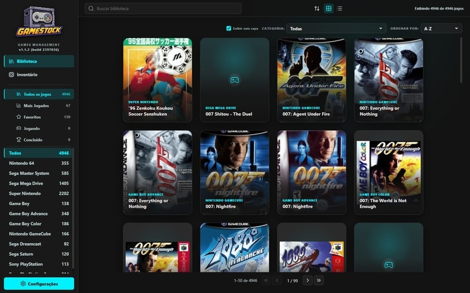
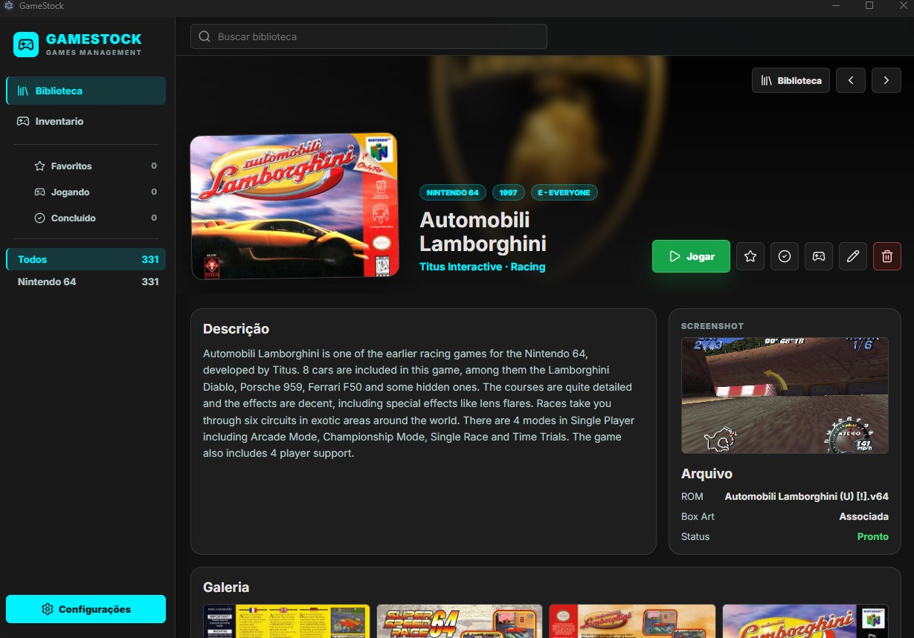

# GameStock

GameStock e um aplicativo desktop para Windows para organizar bibliotecas de jogos retro, ROMs, capas, metadados e inventario fisico. O app roda com Electron, React, TypeScript, Vite e SQLite local via `better-sqlite3`.





## Funcionalidades

- **Biblioteca de jogos**: crie, edite, exclua e consulte jogos com titulo, plataforma, publisher, ano, genero, classificacao, notas, favorito e status de jogo.
- **Grade e lista**: navegue por cards com capas ou por uma lista compacta, com paginacao, ordenacao e navegacao por teclado.
- **Detalhe do jogo**: veja capa, background, screenshot, metadados, caminho da ROM e formulario de edicao em uma tela dedicada.
- **Importacao de metadados no formulario**: busque e importe metadados de bases publicas diretamente pelo formulario de edicao do jogo.
- **Filtros de colecao**: filtre por todos, favoritos, jogando, concluidos e nao jogados.
- **Busca e plataformas**: pesquise por titulo e navegue pela sidebar com plataformas agrupadas por categoria.
- **Gerenciador de plataformas**: cadastre, edite e remova plataformas; configure aliases para correspondencia de metadados e extensoes de ROM aceitas por plataforma.
- **Gerenciador de emuladores**: cadastre emuladores por plataforma, defina o emulador padrao e lance jogos diretamente pela tela de detalhe.
- **Integracao RetroArch**: detecte cores instalados, configure o core padrao por plataforma e lance jogos com o core correto automaticamente.
- **Cadastro manual**: adicione jogos sem depender de fontes externas.
- **Associacao de ROMs**: selecione arquivos ROM por dialogos nativos do sistema.
- **Importador de metadados**: baixe/cacheie metadados publicos, pesquise jogos, escolha tipos de imagem e importe metadados + midias.
- **Importacao por pasta de ROMs**: escaneie pastas ou arquivos, revise candidatos, rode importacao em background e acompanhe progresso. Suporta busca em subpastas e deteccao automatica de plataforma por extensao de ROM.
- **Sincronizacao de capas**: atualize midias de jogos com metadados remotos, acompanhe multiplos jobs simultaneos e veja estatisticas de capas.
- **Notificacoes de jobs**: acompanhe downloads e importacoes em background pela UI. Jobs concluidos ficam visiveis ate serem dispensados manualmente.
- **Resiliencia de jobs**: jobs interrompidos por fechamento do app sao detectados na proxima abertura e exibem botao de retomada. Cards de job tem borda colorida por status (azul=rodando, verde=concluido, vermelho=falhou, amarelo=interrompido).
- **Inventario fisico de hardware**: cadastre e gerencie consoles, perifericos e acessorios fisicos com estado de conservacao, fotos e notas. Visualizacao em cards ou lista com filtro por tipo.
- **Portabilidade de dados**: exporte e importe backup comprimido (`.gamestock-backup`) com metadados, imagens e configuracoes de plataformas e pastas de ROMs. Disponivel em Configuracoes.
- **Verificacao manual de update**: botao em Configuracoes para buscar atualizacoes sem reiniciar o app.
- **Dados locais**: banco, imagens, cache e estado de janela ficam no disco local em `%APPDATA%/gamestock/`.

## Requisitos

- Windows 11
- Node.js 18 ou superior
- npm

## Instalacao

```bash
npm install
```

O `postinstall` executa `electron-builder install-app-deps` para recompilar modulos nativos, como `better-sqlite3`, contra o runtime do Electron usado pelo projeto.

## Desenvolvimento

```bash
npm run dev:windows
```

Esse comando inicia o Vite em `127.0.0.1:5173`, compila `main` e `preload` em modo watch, espera os artefatos em `dist/` e abre o Electron.

Em desenvolvimento, a splash e o updater sao pulados automaticamente. O app abre direto na janela principal.

Se `ELECTRON_RUN_AS_NODE` estiver definido no shell, limpe antes de iniciar o Electron manualmente:

```powershell
$env:ELECTRON_RUN_AS_NODE = $null
```

## Build

Compilar o renderer:

```bash
npm run build:renderer
```

Compilar o processo main e o preload:

```bash
npm run build:main
```

Gerar instalador NSIS e build portatil do Windows em `release/`, e empacotar `release/s3/latest.zip` com `release/s3/meta-dados.json` para publicacao:

```bash
npm run dist:windows
```

## Versao do App

A versao base do aplicativo fica em `package.json`, no campo `version`.

Exemplo:

```json
"version": "1.0.0"
```

O numero do build e gerado automaticamente a partir do commit atual com `git rev-parse --short=7 HEAD`.

Antes de `npm run dev:windows`, `npm run build:renderer`, `npm run build:main` e `npm run dist:windows`, o projeto executa `npm run sync:build-meta`, que atualiza o arquivo gerado `src/shared/build-meta.ts`.

Formato exibido no app:

```text
1.0.0 (build 11e2fc4)
```

Resumo:

- altere a versao manualmente em `package.json`
- nao edite `src/shared/build-meta.ts` manualmente
- o commit/hash da build entra automatico no proximo dev/build
- se `git` nao estiver disponivel, o app mostra apenas a versao base

Exemplo opcional de tag de release apos gerar uma versao:

```bash
git tag v1.0.0
git push origin v1.0.0
```

## Auto Update

O GameStock verifica atualizacoes na splash antes de abrir a janela principal. O comportamento varia por ambiente:

- **Desenvolvimento** (`npm run dev:windows`): splash e updater sao pulados; janela principal abre direto.
- **App empacotado** (`dist:windows`): usa o endpoint padrao `https://s3.alexishida.com/gamestock/meta-dados.json`.
- **CI/build customizado**: sobrescreva o endpoint injetando a variavel de build `UPDATE_MANIFEST_URL`.

Alem do fluxo automatico na abertura, o usuario pode acionar **Buscar atualizacao** manualmente em Configuracoes a qualquer momento.

### Formato do manifesto

O endpoint remoto precisa responder HTTP `200` com um JSON neste formato:

```json
{
  "versao": "1.0.0",
  "build": "11e2fc4",
  "data": "2026-05-21 23:46:58",
  "path": "https://s3.alexishida.com/gamestock/latest.zip"
}
```

Aliases aceitos: `version` para `versao`, `releaseDate` para `data`, `downloadUrl` para `path`, `buildNumber` para `build`.

Regras usadas pelo updater:

- `versao` e comparada com `app.getVersion()` usando semver simples (`x.y.z`); se a versao for igual mas o `build` for diferente, o update tambem e aplicado.
- `path` deve apontar para um `.zip` contendo `resources/app.asar` ou uma pasta raiz `app/`.
- Erro de rede (`ENOTFOUND`, `ECONNREFUSED`, `ETIMEDOUT`) abre modal offline na splash.
- Erro de servidor, JSON invalido ou download corrompido nao bloqueia o app: a splash fecha e o GameStock abre normalmente.

### Publicacao de release

Passo a passo recomendado:

1. Atualize o campo `version` do `package.json`.
2. Execute `npm run dist:windows` — gera instalador, portatil, `release/s3/latest.zip` e `release/s3/meta-dados.json`.
3. Publique `release/s3/latest.zip` na URL configurada.
4. Publique `release/s3/meta-dados.json` no endpoint do manifesto.

Fluxo em runtime:

- splash abre antes da janela principal
- app verifica o manifesto com timeout de 5s
- se houver versao remota mais nova, baixa o ZIP para pasta temporaria
- ZIP e extraido para staging unico `_update_staging_<id>`
- app relanca com `--apply-update <stagingPath>` e copia staging para `resources/app.asar` ou `resourcesPath/app`
- boot seguinte repete a verificacao normalmente

## Testes

Smoke test da importacao por pasta de ROMs:

```bash
npm run test:rom-folder-import
```

E2E do importador de metadados contra o app compilado:

```bash
npm run test:launchbox:e2e
```

E2E do importador de metadados contra o app empacotado em `release/win-unpacked/`:

```bash
npm run test:launchbox:e2e:packaged
```

O E2E compila o app, baixa/cacheia metadados publicos, pesquisa por "Sonic", importa imagens "Box - Front" e verifica se o jogo aparece com capa na grade.

## Dados Locais

O GameStock armazena dados de runtime fora do repositorio:

| Caminho | Conteudo |
|---------|----------|
| `%APPDATA%/gamestock/gamestock.db` | Banco SQLite |
| `%APPDATA%/gamestock/images/` | Capas, backgrounds, screenshots e outras midias baixadas |
| `%APPDATA%/gamestock/launchbox_cache/` | `Metadata.xml`, `index.json` e cache de metadados |
| `%APPDATA%/gamestock/window-bounds.json` | Posicao e tamanho da janela |

Entradas de pastas de ROMs configuradas, historico de jobs e estado persistido da UI ficam no SQLite local, na tabela `app_state`.

## Importador de Metadados

O importador baixa e extrai um pacote publico de metadados e cria um indice local em `index.json`. O cache e reutilizado quando tem menos de 24 horas, salvo quando uma atualizacao forcada e solicitada.

A busca usa o indice local, pode filtrar por plataforma e limita resultados para manter a UI responsiva. Ao importar, o GameStock cria ou atualiza o jogo no SQLite, baixa as imagens escolhidas e gera um `cover.jpg` otimizado com `sharp` quando ha imagem "Box - Front".

## Importacao por Pasta de ROMs

O assistente fica em **Configuracoes > Biblioteca**. Ele permite cadastrar pastas, escolher plataforma, escanear ROMs suportadas, revisar arquivos encontrados e iniciar importacao em background.

Extensoes suportadas incluem `.zip`, `.rom`, `.bin`, `.iso`, `.img`, `.cue`, `.nes`, `.snes`, `.sfc`, `.smc`, `.swc`, `.fig`, `.smd`, `.md`, `.n64`, `.z64`, `.v64`, `.gb`, `.gbc` e `.gba`.

O assistente oferece dois modos: plataforma manual (usuario escolhe) e **deteccao automatica**, que usa as extensoes principais cadastradas por plataforma para identificar e separar ROMs de multiplas plataformas na mesma pasta. A busca em subpastas e opcional e pode ser ativada no formulario de configuracao.

Durante o job, o app tenta casar cada ROM com a base de metadados por titulo e plataforma. Jogos com match sao criados ou atualizados sem duplicar registros; ROMs sem match entram no resumo final.

## Portabilidade de Dados

Disponivel em **Configuracoes**. Permite exportar e importar um pacote `.gamestock-backup` (ZIP) com as seguintes categorias independentes:

- `metadata` — dados do SQLite (jogos, plataformas, emuladores, inventario)
- `images` — capas, backgrounds e screenshots
- `platforms` — configuracoes de plataformas
- `romLocations` — entradas de pastas de ROMs configuradas

Na importacao, imagens sao regravadas para o diretorio de dados atual; caminhos absolutos de outra maquina nao sao preservados. ROMs fisicas nao entram no backup. A importacao e transacional: qualquer falha reverte o banco e exibe resumo do erro.

## Stack

| Camada | Tecnologia |
|--------|------------|
| Desktop shell | Electron 41 |
| Renderer | React 19 + TypeScript + Vite 7 |
| Estado | Zustand 5 |
| Banco | SQLite via `better-sqlite3` |
| IPC | `contextBridge` / `ipcRenderer` |
| Midia | `sharp` |
| Metadados | `adm-zip` + `xml2js` |
| UI icons | `lucide-react` |
| Listas virtualizadas | `react-window` |
| Build | `electron-builder` |

## Arquitetura

- Canais IPC ficam em `src/shared/ipc-channels.ts`.
- Handlers do processo main ficam em `src/main/index.ts`.
- API segura do renderer e exposta em `src/preload/index.ts` como `window.gameStockAPI`.
- Tipos compartilhados ficam em `src/shared/types.ts` e `src/preload/types.d.ts`.
- Codigo SQLite fica em `src/main/db`, com DAOs em `src/main/db/dao` e repositorios em `src/main/db/repositories`.
- Componentes React ficam em `src/renderer/components`.
