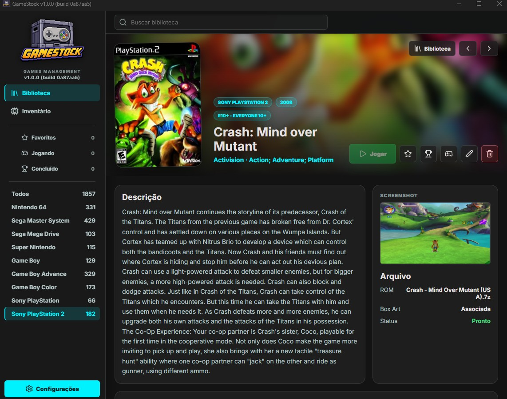
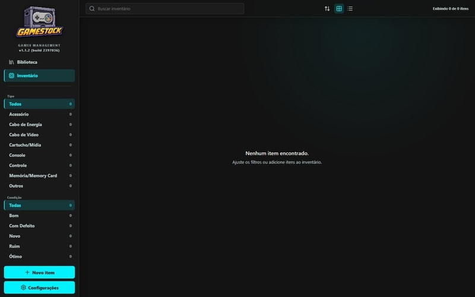
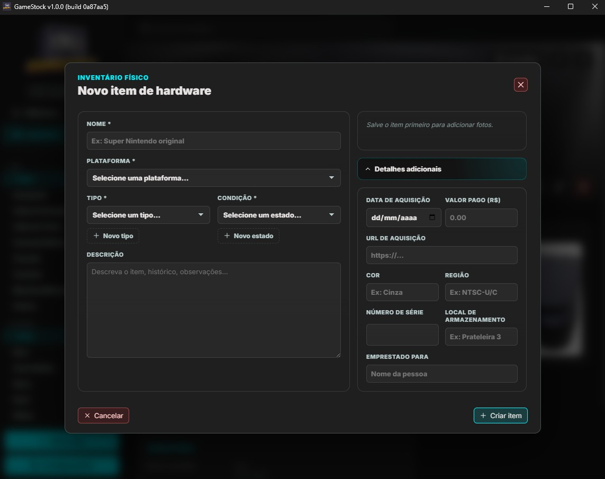
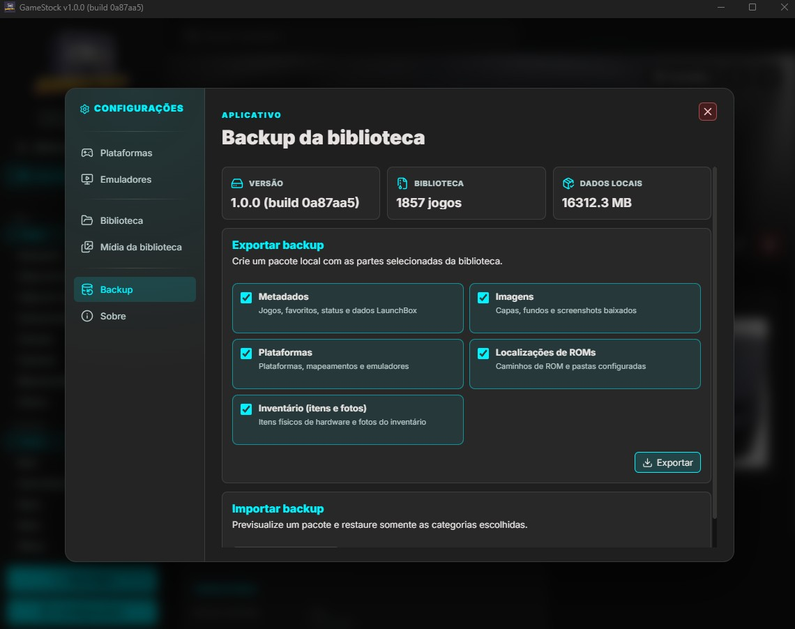

# GameStock

GameStock e um aplicativo desktop para Windows e Linux para organizar bibliotecas de jogos retro, ROMs, capas, metadados e inventario fisico. O app roda com Electron, React, TypeScript, Vite e SQLite local via `better-sqlite3`.

Versao atual: **1.1.3**.

## Capturas de tela










## Funcionalidades

- **Biblioteca de jogos**: crie, edite, exclua e consulte jogos com titulo, plataforma, publisher, ano, genero, classificacao, notas, favorito e status de jogo.
- **Grade e lista**: navegue por cards com capas ou por uma lista compacta, com paginacao SQL, ordenacao e navegacao por teclado.
- **Detalhe do jogo**: veja capa, background, screenshot, metadados, caminho da ROM e formulario de edicao em uma tela dedicada.
- **Importacao de metadados no formulario**: busque e importe metadados de bases publicas diretamente pelo formulario de edicao do jogo.
- **Filtros de colecao**: filtre por todos, favoritos, jogando, concluidos e nao jogados.
- **Busca e plataformas**: pesquise por titulo e navegue pela sidebar com plataformas agrupadas por categoria.
- **Gerenciador de plataformas**: cadastre, edite e remova plataformas; configure aliases para correspondencia de metadados e extensoes de ROM aceitas por plataforma.
- **Gerenciador de emuladores**: cadastre emuladores por plataforma, defina o emulador padrao e lance jogos diretamente pela tela de detalhe.
- **Integracao RetroArch**: detecte todos os cores instalados, atualize a lista ao voltar do Core Updater, configure o core padrao por plataforma e lance jogos com o core correto automaticamente.
- **Cadastro manual**: adicione jogos sem depender de fontes externas.
- **Associacao de ROMs**: selecione arquivos ROM por dialogos nativos do sistema.
- **Importador de metadados**: baixe/cacheie metadados publicos, pesquise jogos, escolha tipos de imagem e importe metadados + midias.
- **Importacao por pasta de ROMs**: escaneie pastas ou arquivos, revise candidatos, rode importacao em background e acompanhe progresso. Suporta busca em subpastas e deteccao automatica de plataforma por extensao de ROM.
- **Sincronizacao de midia**: escolha entre completar somente pendencias ou atualizar dados, capas, fundos e screenshots de todos os jogos vinculados ao LaunchBox.
- **Atualizacao individual**: atualize dados e imagens de um jogo diretamente no formulario de edicao, com notificacao de progresso.
- **Feedback de launch**: botoes Jogar exibem loading enquanto o emulador e a ROM sao preparados.
- **Notificacoes de jobs**: acompanhe downloads e importacoes em background pela UI. Jobs concluidos ficam visiveis ate serem dispensados manualmente.
- **Resiliencia de jobs**: jobs interrompidos por fechamento do app sao detectados na proxima abertura e exibem botao de retomada. Cards de job tem borda colorida por status (azul=rodando, verde=concluido, vermelho=falhou, amarelo=interrompido).
- **Inventario fisico de hardware**: cadastre e gerencie consoles, perifericos e acessorios fisicos com estado de conservacao, fotos e notas. Visualizacao em cards ou lista com filtro por tipo.
- **Portabilidade de dados**: exporte e importe backup comprimido (`.gamestock-backup`) com metadados, imagens e configuracoes de plataformas e pastas de ROMs. Disponivel em Configuracoes.
- **Verificacao manual de update**: botao em Configuracoes para buscar atualizacoes sem reiniciar o app.
- **Biblioteca otimizada**: paginacao carrega os dados completos somente dos jogos exibidos e consolida contagens da sidebar em menos consultas SQLite.
- **Cache LaunchBox resiliente**: leitura do indice ocorre em worker, operacoes simultaneas sao compartilhadas e cache corrompido e reconstruido automaticamente.
- **Dados locais**: banco, imagens, cache e estado de janela ficam no diretorio de dados do usuario do sistema operacional atual.

## Requisitos

- Windows 11 ou desktop Linux `x86_64`
- Node.js 18 ou superior
- npm
- Para build Linux: toolchain nativa capaz de compilar modulos como `better-sqlite3` e `sharp`

## Instalacao

```bash
npm install
```

O `postinstall` executa `electron-builder install-app-deps` para recompilar modulos nativos, como `better-sqlite3`, contra o runtime do Electron usado pelo projeto.

## Desenvolvimento

```bash
npm run dev
```

Esse comando inicia o Vite em `127.0.0.1:5173`, compila `main` e `preload` em modo watch, espera os artefatos em `dist/` e abre o Electron.

Em desenvolvimento, a splash e o updater sao pulados automaticamente. O app abre direto na janela principal.

Alias legado mantido: `npm run dev:windows`.

Se a janela nao abrir corretamente em alguns desktops Linux por problema de GPU/WebGL, rode o app com fallback por software apenas nessa sessao:

```bash
GAMESTOCK_DISABLE_GPU=1 npm run dev
```

## Build

Compilar o renderer:

```bash
npm run build:renderer
```

Compilar o processo main e o preload:

```bash
npm run build:main
```

Gerar instalador NSIS, build portatil e metadados padrao do `electron-builder` em `release/`:

```bash
npm run dist:windows
```

Gerar build Linux (`.deb` + `AppImage`) em `release/`:

```bash
npm run dist:linux
```

## Versao do App

A versao base do aplicativo fica em `package.json`, no campo `version`.

Exemplo:

```json
"version": "1.0.0"
```

O numero do build e gerado automaticamente a partir do commit atual com `git rev-parse --short=7 HEAD`.

Antes de `npm run dev`, `npm run build:renderer`, `npm run build:main`, `npm run dist:windows` e `npm run dist:linux`, o projeto executa `npm run sync:build-meta`, que atualiza o arquivo gerado `src/shared/build-meta.ts`.

Formato exibido no app:

```text
1.1.3 (build <hash-do-commit>)
```

Resumo:

- altere a versao manualmente em `package.json`
- nao edite `src/shared/build-meta.ts` manualmente
- o commit/hash da build entra automatico no proximo dev/build
- se `git` nao estiver disponivel, o app mostra apenas a versao base

Exemplo opcional de tag de release apos gerar uma versao:

```bash
git tag v1.1.3
git push origin v1.1.3
```

## Auto Update

O GameStock verifica atualizacoes automaticamente apenas em builds Windows empacotadas. O comportamento varia por ambiente:

- **Desenvolvimento** (`npm run dev`): splash e updater sao pulados; janela principal abre direto.
- **App empacotado no Windows** (`dist:windows`): consulta a ultima release publica de `alexishida/games-stock` pela API do GitHub.
- **App empacotado no Linux** (`dist:linux`): nao faz self-update; a verificacao manual apenas informa que a atualizacao deve ser feita fora do app.

Alem do fluxo automatico na abertura, o usuario pode acionar **Buscar atualizacao** manualmente em Configuracoes a qualquer momento.

### Assets padrao da GitHub Release

O `electron-updater` consulta a GitHub Release configurada no `app-update.yml` da build. Anexe todos os arquivos Windows gerados por `npm run dist:windows`; os obrigatorios para auto update NSIS sao:

```
GameStock-<versao>-Setup.exe
GameStock-<versao>-Setup.exe.blockmap
latest.yml
```

Regras usadas pelo updater:

- `latest.yml` e gerado pelo `electron-builder` e aponta para instalador NSIS da mesma build.
- Arquivo `.blockmap` deve acompanhar instalador para atualizacao diferencial e validacao SHA-512.
- Nao renomeie nem gere manualmente `latest.yml`, instalador ou `.blockmap`.
- Erro de rede (`ENOTFOUND`, `ECONNREFUSED`, `ETIMEDOUT`) abre modal offline na splash em plataformas com self-update suportado.
- Erro de servidor, JSON invalido ou download corrompido nao bloqueia o app: a splash fecha e o GameStock abre normalmente.
- O fluxo `download -> staging -> relaunch` existe apenas no Windows empacotado.

### Publicacao de release

Passo a passo recomendado:

### Publicacao Windows

1. Atualize o campo `version` do `package.json`.
2. Execute `npm run dist:windows`.
3. Crie uma GitHub Release publica com tag `vX.Y.Z` no repositorio `alexishida/games-stock`.
4. Envie todos arquivos Windows gerados em `release/`, sem renomear.
5. Confirme que `latest.yml`, instalador NSIS e respectivo `.blockmap` pertencem a mesma build. O portatil e distribuicao manual.

### Publicacao Linux

1. Atualize o campo `version` do `package.json`.
2. Execute `npm run dist:linux`.
3. Distribua o `.deb` para Ubuntu/Linux Mint/Pop!_OS e afins.
4. Distribua o `AppImage` como alternativa generica para outras distros desktop.
5. Nao publique `update.zip` Linux para self-update; a atualizacao e externa ao app.

Fluxo em runtime no Windows:

- splash abre antes da janela principal
- app consulta metadados `latest.yml` da ultima GitHub Release
- se houver versao remota mais nova, baixa instalador NSIS padrao
- `electron-updater` valida download e executa instalador ao reiniciar
- build portatil nao faz auto update; baixe novo executavel da release

Fluxo em runtime no Linux:

- app abre direto na janela principal
- botao **Buscar atualizacao** consulta metadados gerados pelo electron-builder
- se houver release mais nova, a UI informa que a troca deve ser feita via `.deb`, `AppImage` ou gerenciador da distribuicao
- nenhum ZIP e baixado, nenhum staging e aplicado, nenhum relaunch automatico acontece

## Testes

Validação estática completa de main, preload e renderer:

```bash
npm test
```

O comando executa TypeScript estrito com detecção de variáveis e parâmetros não usados. Testes E2E de Electron devem ser adicionados novamente junto com cenários reproduzíveis e seus fixtures, antes de voltar a expor scripts públicos de E2E.

Regressoes de desempenho e concorrencia da biblioteca e do cache LaunchBox:

```bash
node scripts/test-optimizations.cjs
```

Esse teste usa banco SQLite e cache temporarios. Nenhum dado real do usuario e lido ou alterado. Em benchmark sintetico com 30 mil registros, a listagem geral caiu de aproximadamente 560 ms para 232 ms e as contagens da sidebar de 398 ms para 209 ms; os tempos variam conforme hardware e filtros.

Observacoes para Linux:

- `npm run dist:linux` e o smoke principal de empacotamento Linux.
- Modulos nativos como `better-sqlite3` e `sharp` dependem de toolchain e libs do sistema corretamente instaladas.
- `AppImage` pode exigir `libfuse2` ou compatibilidade equivalente dependendo da distribuicao.

## Dados Locais

O GameStock armazena dados de runtime fora do repositorio:

| Caminho | Conteudo |
|---------|----------|
| Windows: `%APPDATA%/gamestock/gamestock.db` | Banco SQLite |
| Windows: `%APPDATA%/gamestock/images/` | Capas, backgrounds, screenshots e outras midias baixadas |
| Linux: `$XDG_DATA_HOME/gamestock/` ou `~/.local/share/gamestock/` | Banco, imagens, cache LaunchBox e estado de janela |
| `<data-dir>/window-bounds.json` | Posicao e tamanho da janela |

Entradas de pastas de ROMs configuradas, historico de jobs e estado persistido da UI ficam no SQLite local, na tabela `app_state`.

Quando `GAMESTOCK_USER_DATA_DIR` estiver definida, ela sobrescreve o diretorio padrao em qualquer plataforma.

## Importador de Metadados

O importador baixa e extrai um pacote publico de metadados e cria um indice local em `index.json`. O cache e reutilizado quando tem menos de 24 horas, salvo quando uma atualizacao forcada e solicitada. Leitura e desserializacao rodam em worker para manter a janela responsiva. Chamadas simultaneas compartilham download ou indexacao em andamento; cache JSON invalido e reconstruido automaticamente a partir do XML local.

A busca usa o indice local, pode filtrar por plataforma e limita resultados para manter a UI responsiva. Ao importar, o GameStock cria ou atualiza o jogo no SQLite, baixa as imagens escolhidas e gera um `cover.jpg` otimizado com `sharp` quando ha imagem "Box - Front".

## Importacao por Pasta de ROMs

O assistente fica em **Configuracoes > Biblioteca**. Ele permite cadastrar pastas, escolher plataforma, escanear ROMs suportadas, revisar arquivos encontrados e iniciar importacao em background.

Extensoes suportadas incluem `.zip`, `.rom`, `.bin`, `.iso`, `.img`, `.cue`, `.nes`, `.snes`, `.sfc`, `.smc`, `.swc`, `.fig`, `.smd`, `.md`, `.n64`, `.z64`, `.v64`, `.gb`, `.gbc` e `.gba`.

O assistente oferece dois modos: plataforma manual (usuario escolhe) e **deteccao automatica**, que usa as extensoes principais cadastradas por plataforma para identificar e separar ROMs de multiplas plataformas na mesma pasta. A busca em subpastas e opcional e pode ser ativada no formulario de configuracao.

Durante o job, o app tenta casar cada ROM com a base de metadados por titulo e plataforma. Jogos com match sao criados ou atualizados sem duplicar registros; ROMs sem match entram no resumo final.

## Portabilidade de Dados

Disponivel em **Configuracoes**. Permite exportar e importar um pacote `.gamestock-backup` (ZIP) com as seguintes categorias independentes:

- `metadata` — dados do SQLite (jogos, plataformas, emuladores, inventario)
- `images` — capas, backgrounds e screenshots
- `platforms` — configuracoes de plataformas
- `romLocations` — entradas de pastas de ROMs configuradas

Na importacao, imagens sao regravadas para o diretorio de dados atual; caminhos absolutos de outra maquina nao sao preservados. ROMs fisicas nao entram no backup. A importacao e transacional: qualquer falha reverte o banco e exibe resumo do erro.

## Stack

| Camada | Tecnologia |
|--------|------------|
| Desktop shell | Electron 41 |
| Renderer | React 19 + TypeScript + Vite 7 |
| Estado | Zustand 5 |
| Banco | SQLite via `better-sqlite3` |
| IPC | `contextBridge` / `ipcRenderer` |
| Midia | `sharp` |
| Metadados | `adm-zip` + `xml2js` |
| UI icons | `lucide-react` |
| Build | `electron-builder` |

## Arquitetura

- Canais IPC ficam em `src/shared/ipc-channels.ts`.
- Handlers do processo main ficam em `src/main/index.ts`.
- API segura do renderer e exposta em `src/preload/index.ts` como `window.gameStockAPI`.
- Tipos compartilhados ficam em `src/shared/types.ts` e `src/preload/types.d.ts`.
- Codigo SQLite fica em `src/main/db`, com DAOs em `src/main/db/dao` e repositorios em `src/main/db/repositories`.
- Componentes React ficam em `src/renderer/components`.
